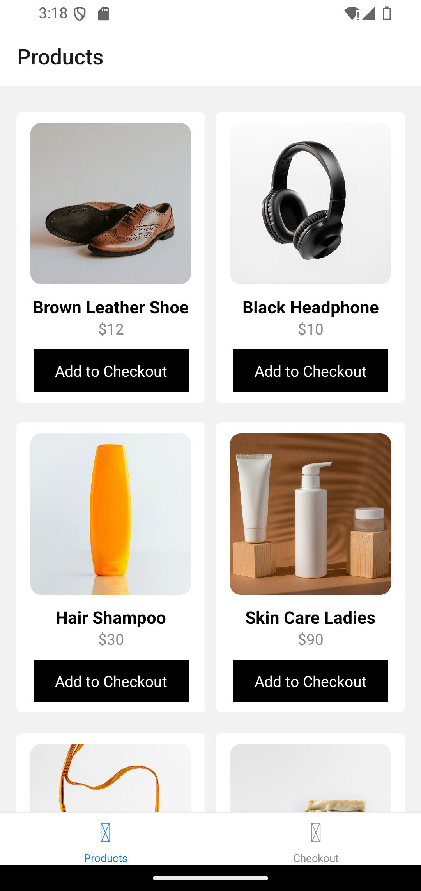
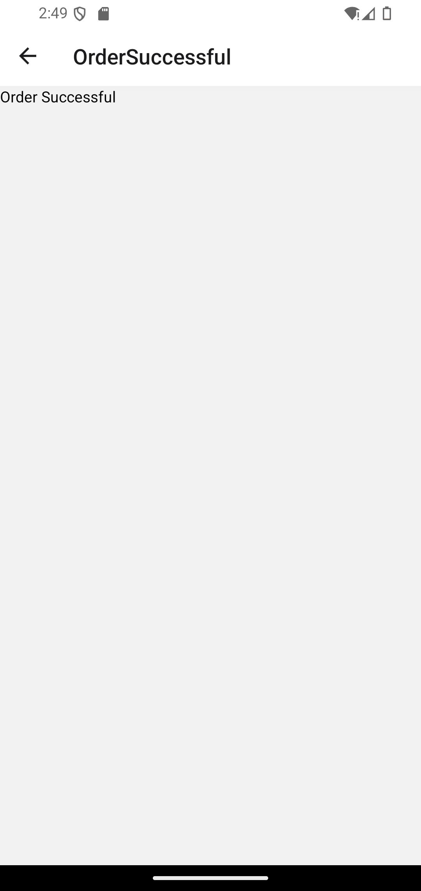

# Simple Shopping App

Welcome to the Simple Shopping App, a React Native application developed by Zainab Musa. This app features a user-friendly interface with a bottom navigation bar and basic functionalities for browsing products and managing a shopping cart.

## Table of Contents

- [Features](#features)
- [Screenshots](#screenshots)
- [Installation](#installation)
- [Usage](#usage)
- [APK Download](#apk-download)
- [Live Demo](#live-demo)

## Features

- **Products Screen**: Browse and view a list of products.
- **Checkout Screen**: View items added to the cart and proceed to checkout.
- **Order Successful Screen**: Confirmation message after a successful order.
- **Bottom Navigation**: Easily navigate between different screens.

## Screenshots

### Products Screen


### Checkout Screen


### Order Successful Screen


## Installation

1. Clone the repository:
   ```bash
   git clone https://github.com/Zeemari/shoppingapp.git
   ```
2. Navigate to the project directory:
   ```bash
   cd shoppingapp
   ```
3. Install dependencies:
   ```bash
   npm install
   ```
4. Start the application:
   ```bash
   npm start
   ```

## Usage

1. Open the Expo Go app on your device.
2. Scan the QR code generated by `npm start` to run the app on your device.

## APK Download

You can download the APK file [here](https://drive.google.com/file/d/12DiXzajM2Ch5vzRLkoXYjK7Tpzu4gfRC/view?usp=drive_link).

## Live Demo

Check out the live demo on Appetize.io [here](https://appetize.io/app/u5odofg2joid5pedj2oviqkqb4?device=pixel7&osVersion=13.0).

## Contributing

Contributions are welcome! Please fork the repository and submit a pull request.

